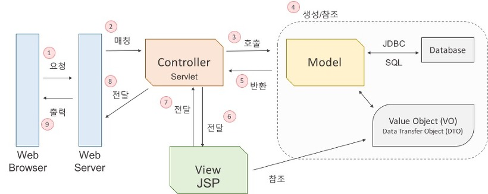

# 개발상식

* [객체 지향 프로그래밍](#객체-지향-프로그래밍)
    * 장점
    * 단점
* [RESTful API](#restful-api)
    * RESTful 하게 API 를 디자인 한다는 것은 무엇을 의미하는가
    * 장점
    * 단점
* [TDD란?](#tdd)
    * ADD a Test
    * Run All Tests And See If New One Fails
    * Refactor Code
    * 의문점들
* [함수형 프로그래밍](#함수형-프로그래밍)
    * Immtable vs Mutable
    * First-Citizen
    * Reactive Programming
* [MVC 패턴](#mvc-패턴)
    * 모델(Model)
    * 뷰(View)
    * 컨트롤러(Controller)

--------------------------------------------------------------------------

# 객체 지향 프로그래밍

## 장점

1. 인간 중심적 프로그래밍 패러다임이다. 즉, 현실 세계를 프로그래밍으로 옮겨와 프로그래밍하는 것을 말한다. 현실 세계의 사물들을 객체라고 보고 그 객체로부터 개발하고자 하는 어플리케이션에 필요한 특징들을 뽑아와 프로그래밍 하는 것이다. 이것을 추상화라 한다.
2. 이미 작성한 코드에 대한 재사용성이 높아진다.
3. 내부적으로 어떻게 동작하는지 몰라도 개발자는 라이브러리가 제공하는 기능들을 사용할 수 있기 때문에 생산성이 높아지게 된다.
4. 객체 단위로 코드가 나눠져 작성되기 때문에 디버깅이 쉽고 유지 보수에 용이하다.
5. 데이터 모델링을 할 때 객체와 매핑하는 것이 수월하기 때문에 요구사항을 보다 명확하게 파악하여 프로그래밍 할 수 있다.

## 단점

1. 객체 간의 정보 교환이 모두 메시지 교환을 통해 일어나므로 실행 시스템에 많은 Overhead가 발생하게 된다. 하지만 이것은 하드웨어의 발전으로 많은 부분 보완되었다.
2. 함수형 프로그래밍과 달리 객체가 상태를 갖는다. 변수가 존재하고 이 변수를 통해 객체가 예측할 수 없는 상태를 갖게 되어 어플리케이션 내부에서 버그를 발생시킨다. 이러한 이유로 함수형 프로그래밍 패러다임이 주목받고 있다.

--------------------------------------------------------------------------
# RESTful API

 > 인터넷 리소스를 정의하고 자원에 대한 주소를 지정하는 방법 전반에 대한 패턴

한 마디로, RESTful API는 `Resource Oriented Architecture` 이다. API 설계의 중심에 자원(Resource)이 있고 HTTP Method를 통해 자원을 처리하도록 설계하는 것이다.

## RESTful 하게 API 를 디자인 한다는 것은 무엇을 의미하는가

1. 리소스와 행위를 명시적이고 직관적으로 분리한다.

* 리소스는 `URI`로 표현되는데 리소스가 가리키는 것은 `명사`로 표현되어야 한다.
* 행위는 `HTTP Method`로 표현하고, `GET(조회)`, `POST(생성)`, `PUT(기존 Entity 전체 수정)`, `PATCH(기존 Entity 일부 수정)`, `DELETE(삭제)`, `OPTIONS(특정 END Point의 허용 Method 확인)` 을 분명한 목적으로 사용한다.

2. Message는 Header와 Body를 명확하게 분리해서 사용한다.

* `Entity` 에 대한 내용은 `Body` 에 담는다.
* 애플리케이션 서버가 행동할 판단의 근거가 되는 컨트롤 정보인 API 버전 정보, 응답받고자 하는 MIME 타입 등은 Header에 담는다.

3. API 버전을 관리한다.

* 환경은 항상 변하기 때문에 API의 Signature가 변경될 수도 있음에 유의하자.
* 특정 API를 변경할 때는 반드시 하위호환성을 보장해야한다.

4. 서버와 클라이언트가 같은 방식을 사용해서 요청하도록 한다.

* 브라우저는 Form-data 형식의 Submit 으로 보내고 서버에서는 Json 형태로 보내는 식의 분리보다는 Json 으로 보내든, 둘 다 Form-data 형식으로 보내든 하나로 통일한다.
* 다른 말로 표현하자면 URI가 플랫폼 중립적이어야 한다.

## 장점

1. Open API를 제공하기 쉽다.
2. 멀티플랫폼 지원 및 연동이 용이하다.
3. 원하는 타입으로 데이터를 주고 받을 수 있다.
4. 기존 웹 인프라(HTTP)를 그대로 사용할 수 있다.

## 단점

1. 사용할 수 있는 메소드가 4 가지 밖에 없다.

 > 이게 왜 단점일까?

2. 분산환경에는 부적합하다.

 > 왜?+

3. HTTP 통신 모델에 대해서만 지원한다.

--------------------------------------------------------------------------
# TDD

`Test-Driven Development(TDD)`는 매우 짧은 개발 사이클의 반복에 의존하는 소프트웨어 개발 프로세스이다. 우선 개발자는 요구되는 새로운 기능에 대한 자동화된 테스트케이스를 작성하고 해당 테스트를 통과하는 가장 간단한 코드를 작성한다. 일단 테스트 통과하는 코드를 작성하고 상황에 맞게 리팩토링하는 과정을 거치는 것이다. 말 그대로 테스트가 코드 작성을 주도하는 개발방식인 것이다.

## ADD a Test

테스트 주도형 개발에선, 새로운 기능을 추가히기 전에 테스트 코드를 먼저 작성한다. 테스트를 작성하기 위해서, 개발자는 해당 기능의 요구사항과 명세를 분명히 이해하고 있어햐 한다. 이는 사용자 케이스와 사용자 스토리 등으로 이해할 수 있으며, 이는 개발자가 코드를 작성하기 전에 보다 요구사항에 집중할 수 있도록 도와준다. 이는 정말 중요한 부분이자 테스트 주도 개발이 주는 이점이라고 볼 수 있다.

## Run All Tests And See If New One Fails

어떤 새로운 기능을 추가하면 잘 작동하던 기능이 제대로 작동하지 않는 경우가 발생할 수 있다. 더 위험한 경우는 개발자가 이를 미쳐 인지하지 못하는 경우이다. 이러한 경우를 방지하기 위해 테스트 코드를 작성하는 것이다. 새로운 기능을 추가할 때 테스트 코드를 작성함으로써, 새로운 기능이 제대로 작동함과 동시에 기존의 기능들이 잘 작동하는지 테스트를 통해 확인할 수 있는 것이다.

## Refactor Code

`좋은 코드`를 작성하기란 정말 쉽지가 않다. 코드를 작성할 때 고려해야할 요소가 한 두 가지가 아니기 때문이다. 가독성이 좋게 Coding Convention을 맞춰야 하며, 네이밍 규칙을 적용하여 메소드명, 변수명, 클래스명에 일관성을 주어야 하며, 앞으로의 확장성 또한 고려해야 한다. 이와 동시에 비즈니스 로직에 대한 고려도 반드시 필요하며, 예외처리 부분 역시 빠뜨릴 수 없다. 물론 코드량이 적을 때는 이런 저런 것들을 모두 신경쓰면서 코드를 작성할 수 있지만 끊임없이 발견되는 버그들을 디버깅 하는 과정에서 코드가 더럽혀지기 마련이다.

이러한 이유로 코드량이 방대해지면서 리펙토링을 하게 된다. 이 때 테스트 주도 개발을 통해 개발을 해왔다면, 테스트 코드가 그 중심을 잡아줄 수 있다. 뚱뚱해진 함수를 여러 함수로 나누는 과정에서 해당 기능이 오작동을 일으킬 수 있지만 간단히 테스트를 돌려봄으로써 이에 대한 안심을 하고 계속해서 리팩토링을 진행할 수 있다. 결과적으로 리팩토링 속도도 빨라지고 코드의 퀄리티도 그만큼 향상하게 되는 것이다. 코드 퀄리티 부분을 조금 상세히 들어가보면, 보다 객체지향적이고 확장 기능이 용이한 코드, 재설계의 시간을 단축시킬 수 있는 코드, 디버깅 시간이 단축되는 코드가 TDD와 함께 탄생하는 것이다.

어차피 코드를 작성하고 나서 제대로 작동하는지 판단해야하는 시점이 온다. 물론 중간 중간 수동으로 확인도 할 것이다. 또 테스트에 대한 문서도 만들어야 한다. 그 부분을 자동으로 해주면서, 코드 작성에 도움을 주는 것이 TDD인 것이다.

## 의문점들

### Q. 코드 생산성에 문제가 있지는 않나?

두 배는 아니더라도 분명 코드량이 늘어난다. 비즈니스 로직, 각종 코드 디자인에도 시간이 많이 소요되는데, 거기에다가 테스트 코드까지 작성하기란 여간 벅찬 일이 아닐 것이다. 코드 퀄리티 보다는 빠른 생산성이 요구되는 시점에서 TDD는 큰 걸림돌이 될 수 있다.

### Q. 테스트 코드를 작성하기가 쉬운가?

이 또한 TDD 라는 개발 방식을 적용하기에 큰 걸림돌이 된다. 진입 장벽이 존재한다는 것이다. 어떠한 부분을 테스트해야할 지, 어떻게 테스트해야할 지, 여러 테스트 프레임워크 중 어떤 것이 우리의 서비스와 맞는지 등 여러 부분들에 대한 학습이 필요하고 익숙해지는데도 시간이 걸린다. 팀에서 한 명만 익숙해진다고 해결될 일이 아니다. 개발은 팀 단위로 수행되기 때문에 팀원 전체의 동의가 필요하고 팀원 전체가 익숙해져야 비로소 테스트 코드가 빛을 발하게 되는 것이다.

### Q. 모든 상황에 대해서 테스트 코드를 작성할 수 있는가? 작성해야 하는가?

세상에는 다양한 사용자가 존재하며, 생각지도 못한 예외 케이스가 존재할 수 있다. 만약 테스트를 반드시 해봐야 하는 부분에 있어서 테스트 코드를 작성하는데 어려움이 발생한다면? 이러한 상황에서 주객이 전도되는 상황이 발생할 수 있다. 분명 실제 코드가 더 중심이 되어야 하는데 테스트를 위해서 코드의 구조를 바꿔야 하나하는 고민이 생긴다. 또한 발생할 수 있는 상황에 대한 테스트 코드를 작성하기 위해 배보다 배꼽이 더 커지는 경우가 허다하다. 실제 구현 코드보다 방대해진 코드를 관리하는 것도 쉽지만은 않은 일이 된것이다.

모든 코드에 대해서 테스트 코드를 작성할 수 없으며 작성할 필요도 없다. 또한, 테스트 코드를 작성한다고 해서 버그가 발생하지 않는 것도 아니다. 애초에 TDD 는 100% Coverage와 100% 무결성을 주장하지 않았다.

--------------------------------------------------------------------------
# 함수형 프로그래밍

## Immutable vs Mutable

우선 `Immutable`과 `Mutable`의 차이에 대해서 이해를 하고 있어햐 한다. `Immutable`이란 말 그대로 변경 불가능함을 의미한다. `Immutable` 객체는 객체가 가지고 있는 값을 변경할 수 없는 객체를 의미하여 값이 변경될 경우, 새로운 객체를 생성하고 변경된 값을 주입하여 반환해야 한다. 이와는 달리, Mutable 객체는 해당 객체의 값이 변경될 경우 값을 변경한다.

## First-Citizen

함수형 프로래밍 패러다임을 따르고 있는 언어에서의 `함수(Function)`는 `일급 객체(First Class Citizen)`로 간주된다. 일급 객체라 함은 다음과 같다.

* 변수나 데이터 구조 안에 함수를 담을 수 있어서 함수의 파라미터로 전달할 수 있고, 함수의 반환 값으로 사용할 수 있다.
* 할당에 사용된 이름과 관계없이 고유한 구별이 가능하다.
* 함수를 리터럴로 바로 정의할 수 있다.

## Reactive Programming

`반응형 프로그래밍(Reactive Programming)`은 선언형 프로그래밍(Declarative Programming)이라고도 불리며, 명령형 프로그래밍(Imperative Programming)의 반댓말이다. 또 함수형 프로그래밍 패러다임을 활용하는 것을 말한다. 반응형 프로그래밍은 기본적으로 모든 것을 스트림(Stream)으로 본다. 스트림이란 값들의 집합을 볼 수 있으며 제공되는 함수형 메소드를 통해 데이터를 Immutable 하게 관리할 수 있다.

--------------------------------------------------------------------------
# MVC 패턴

모델(Model),  뷰(View), 컨트롤러(Controller)가 나뉘어 서버를 구성하는 모델을 말한다.

## 모델(Model)

컨트롤러가 호출할 때, 요청에 맞는 역할을 수행한다. 비즈니스 로직을 구현하는 영역으로 응용프로그램에서 데이터를 처리하는 부분이다. DB에 연결하고 데이터를 추출하거나 저장, 삭제, 업데이트, 변환 등의 작업을 수행한다. 상태의 변화가 있을 때 컨트롤러와 뷰에 통보해 후속 조치 명령을 받을 수 있게 한다.

 > 비즈니스 로직이란 업무에 필요한 데이터 처리를 수행하는 응용프로그램의 일부라고 할 수 있다.

## 뷰(View)

컨트롤러로부터 받은 모델의 결과값을 가지고 사용자에게 출력할 화면을 만드는 일을 한다. 만들어진 화면을 웹 브라우저에 전송하여 웹 브라우저가 출력하게 하는 것이다. 화면에 표시되는 부분으로 추출한 데이터나 일반적인 텍스트 데이터를 표시하거나 입력 폼 또는 사용자와의 상호작용을 위한 인터페이스를 표시하는 영역이다.

## 컨트롤러(Controller)

일종의 조정자(Mutator)라고 할 수 있다. 클라이언트의 요청을 받았을 때, 그 요청에 대해 실제 업무를 수행하는 모델 컴포넌트를 호출한다. 또한 클라이언트가 보낸 데이터가 있다면, 모델에 전달하기 쉽게 데이터를 가공한다. 모델이 업무를 마치면 그 결과를 뷰에게 전달한다.

--------------------------------------------------------------------------
